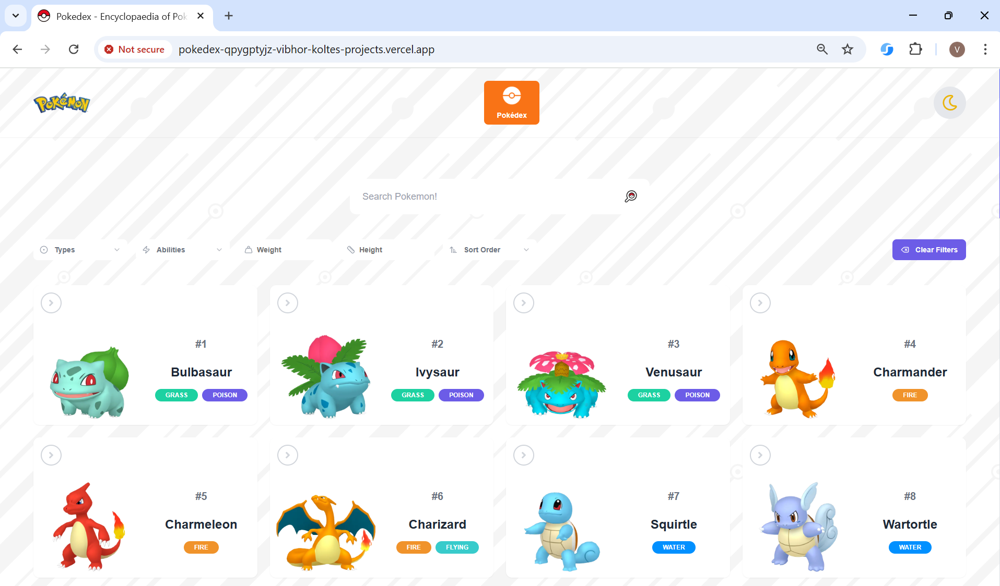
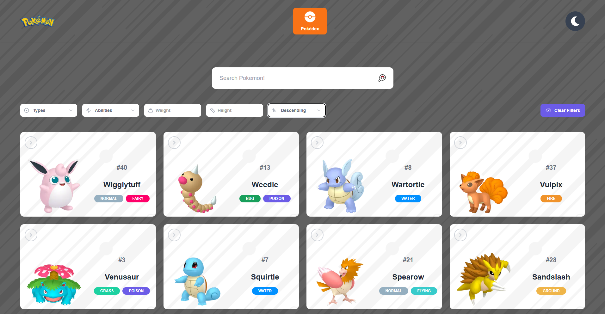
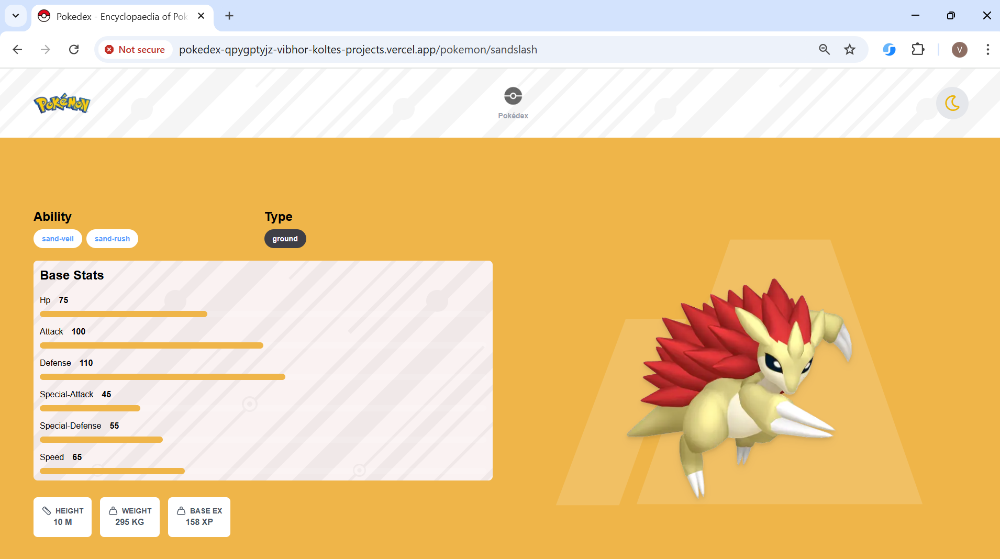
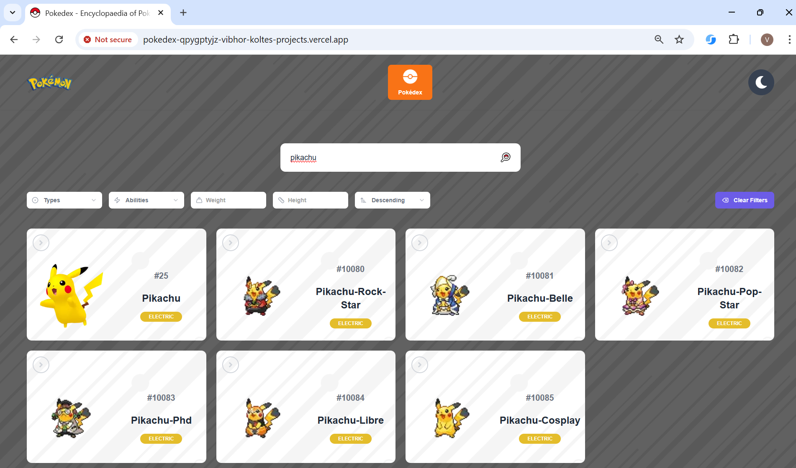

# pokedex
Pokemon Encyclopedia using PokéAPI

Pokedex Home Screen

Filter and Sort Pokemons

View Pokemon Details

Search Feature

# Where we started from =>

As part of this task, develop a search engine for Pokemon ( [A pokedex !](https://www.pokemon.com/us/pokedex/))

API to fetch pokemon details - 
https://pokeapi.co/docs/v2

Your product should allow users to -
- search for a pokemon given the name
- display intersting attributes around the pokemon included the api response

# Specifications

Your product should have 2 components

- Web service API (serving restful APIs using java)

- Front end layer rendering content ( NextJS app with shadcn-ui and tailwind )

## Web service

Develop a web service component that fetches the details from above API and serves them via an exposed API. 
Your service should cache vendor responses and give speedier result for repeating queries. 
You should handle typical scenarios that come with using a cache like cache expiry, max cache entries etc.

## UI layer
You may go with any design you wish to. Bonus points if the UI can display rich information. 
Use this as an opportunity to impress us with your creativity. You have freedom to choose your own UI libraries.

<strong><u>Points to note :</u></strong>
- Please follow REST API guidelines when designing your web service APIs
- The service should run locally (ie the entire code should run locally via some framework, for example, a java project wrapped as a jar)
- If any guidelines here are not followed, that will be treated as an invalid submission

<strong><u>Aspects we will be looking at closely -</u></strong>
- Code quality, handling of conditions, edge cases
- Structuring of code for extensibility
- Good java/javascript coding practices
- Overall UI look and feel
- PERFORMANCE

<strong><u>Submission -</u></strong>
- Upload your code to a <strong>public</strong> github repository
- Reply to the email where you received the coding challenge <strong> without changing the subject</strong> to submit your submission
- <strong>Include a link to the github repo with your submission in the body</strong>

Expectation
    Good code quality and having 70% test coverage.
    Naming standard should be followed and should build its own domain language as per the requirement. Which makes the code readable. 
    Secruity vulnerability should not be there in the developed solution.
    Code should be performant.

Happy Coding :)